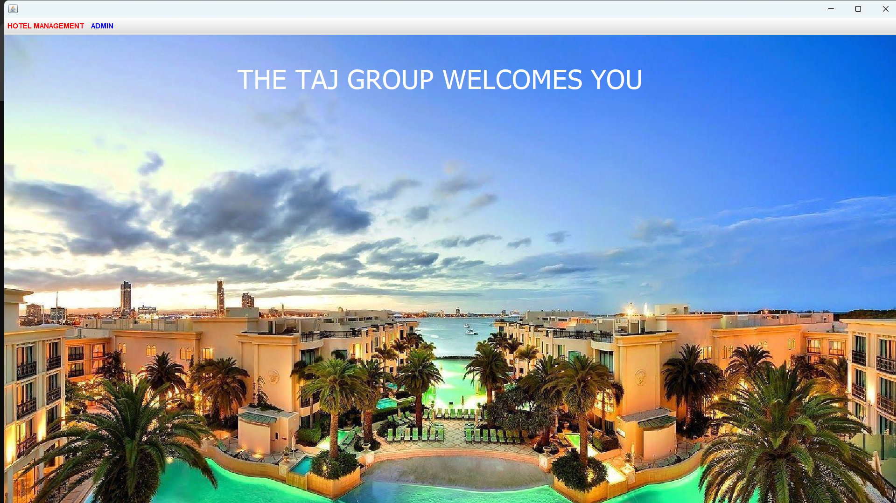
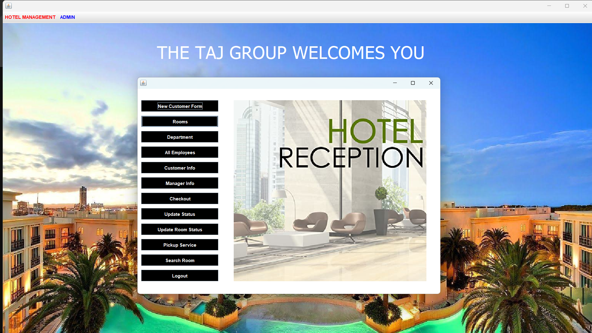
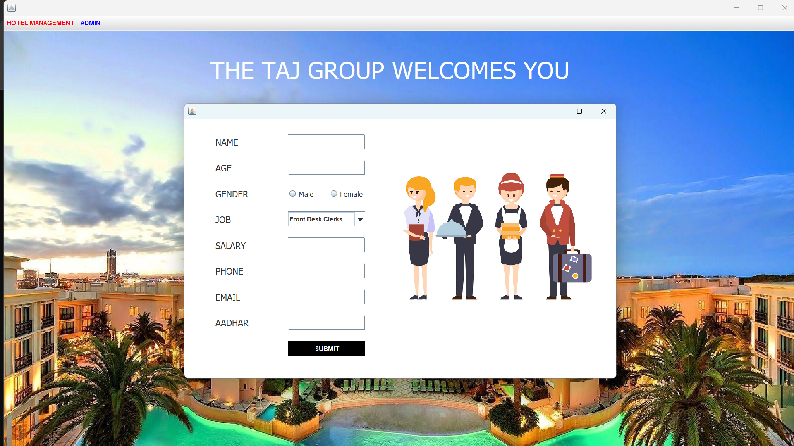
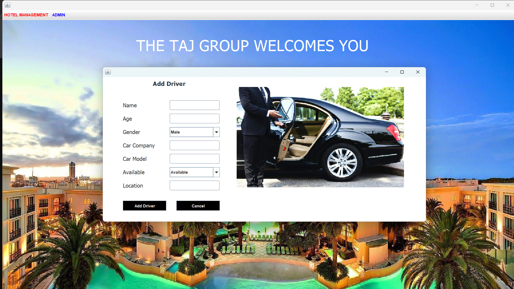
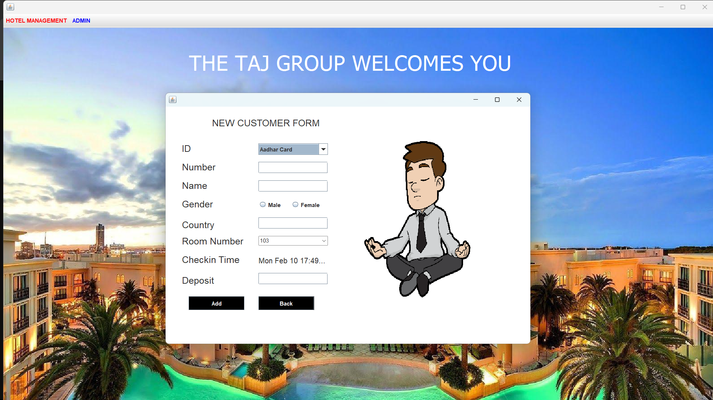
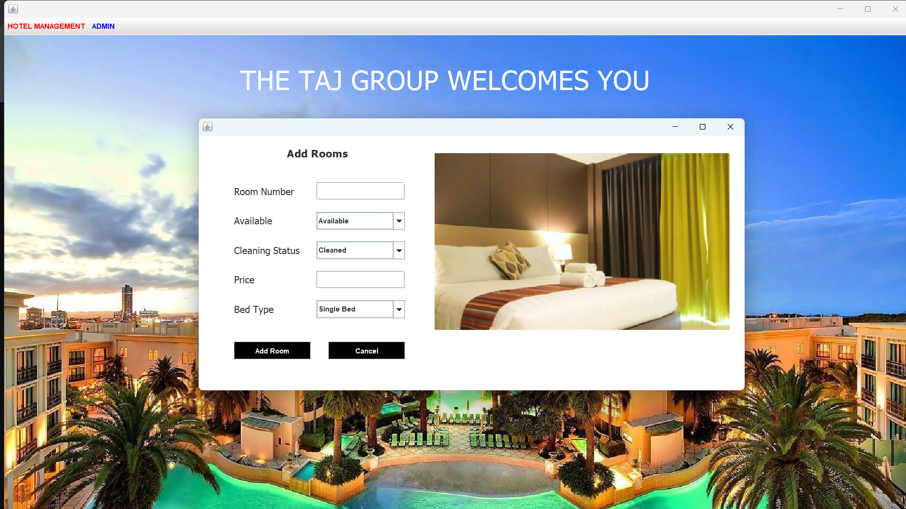
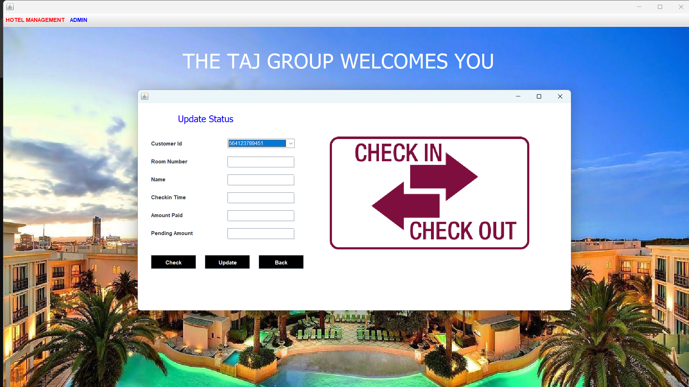
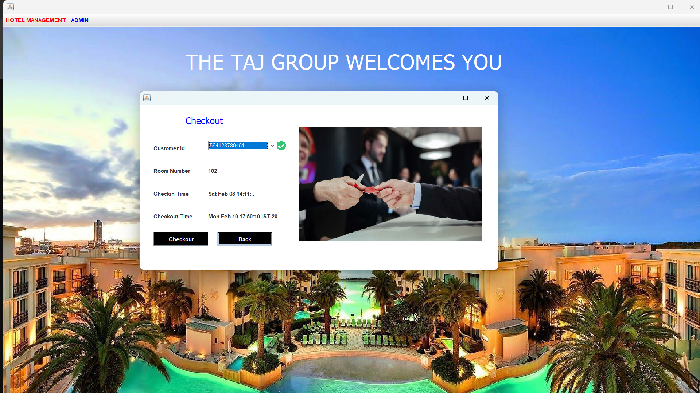

# 🏨 Hotel Management System

A **Hotel Management System** built using **Java** and **Apache NetBeans IDE**.
This project helps in managing hotel operations such as booking, customer management, and room availability tracking.

## 📖 Project Overview
This system automates hotel operations by providing functionalities such as room booking, customer record management, and billing.
It allows administrators and staff to manage room availability, check-in/check-out processes, and generate invoices efficiently.
The system ensures smooth hotel operations with a user-friendly graphical interface.

## 🔄 Project Flow
1. **User Authentication**
   - Admins and staff log in with credentials.
   - Access to different features is role-based.

2. **Room Management**
   - Add, edit, and delete room details.
   - Update room availability based on check-ins and check-outs.

3. **Customer Management**
   - Register new customers with personal details.
   - Update and delete customer records.

4. **Booking & Check-in/Check-out**
   - Customers can be assigned rooms based on availability.
   - Check-in process records customer details and room allocation.
   - Check-out process calculates total charges and updates room status.

---

## 📌 Features
✅ Add, edit, and delete customer details  
✅ Room booking and management  
✅ Check-in and check-out functionality  
✅ User authentication system (Admin & Staff roles)  
✅ View and update room availability  
✅ Database integration for storing hotel records  

---

## 🛠 Technologies Used
- **Java** (Core Java, Swing for UI)
- **Apache NetBeans IDE** (Development environment)
- **MySQL** (Database for storing records)
- **JDBC** (Java Database Connectivity for MySQL integration)

---

## 🚀 Installation and Setup

### ✅ Prerequisites
- Install **Java JDK** (Java Development Kit)
- Install **Apache NetBeans IDE**
- Install **MySQL Server & MySQL Workbench**

### 🛠 Steps to Run the Project
1. **Clone the Repository**
   ```sh
   git clone https://github.com/Vinayak180302/Hotel-management-system.git
   ```
2. **Open in Apache NetBeans**
   - Open **NetBeans IDE** and go to **File > Open Project**
   - Select the cloned project folder

3. **Set Up Database**
   - Open **MySQL Workbench** and create a database
   - Import the provided SQL file (`Hotel.sql` )
   - Update the database connection settings in the Java code

4. **Run the Project**
   - In NetBeans, select the main file and click **Run**
   - Login using the default credentials.

## 🖼 Screenshots

### 🔹 Login Page


### 🔹 Dashboard


### 🔹 Add Employee


### 🔹 Add Driver


### 🔹 Add New Costumer


### 🔹 Add Room


### 🔹 Update Room Status


### 🔹 Checkout


